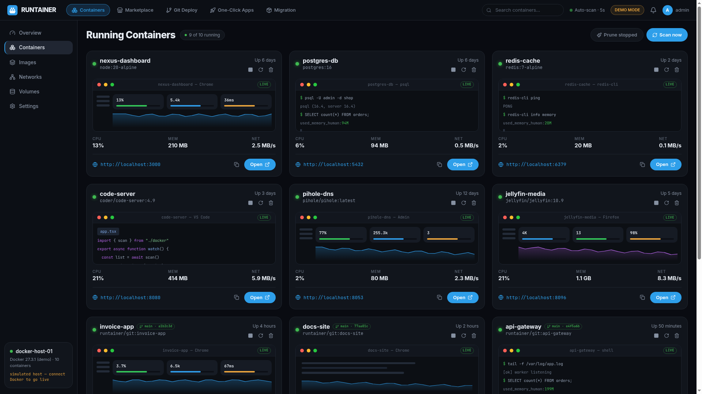
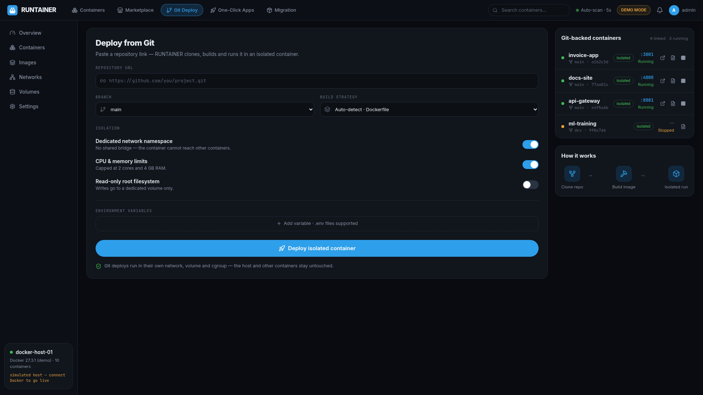
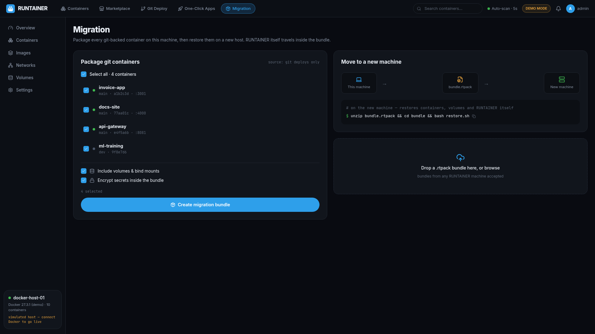

<div align="center">
  
  
  
  

  <h1>RUNTAINER</h1>
  <p><strong>The friendly command center for your containers.</strong><br/>
  See every container on your host, open it with one click, deploy from marketplaces or straight from Git — and move it all to a new machine with a single file.</p>
</div>

---



## Why RUNTAINER?

Running containers is easy. **Knowing what's running, where to click, and how to move it all later — isn't.** RUNTAINER scans your host automatically and turns every container into a card with a live preview, resource stats and a direct access link. No CLI required, but the power is there when you want it.

## Features

### Containers — see everything, instantly
- **Auto-scan** of every container on the host (every 5 s, adjustable)
- **Live window preview** of each running app, next to its **access link** (`http://host:port`) — copy or open in one click
- CPU / memory / network stats per container
- Start · stop · restart · remove from the GUI
- **Fine-tune before you deploy**: ports, environment variables, CPU & memory limits, restart policy, network mode, read-only root filesystem

### Marketplace — one-click from public registries
- Curated app templates (Nginx, PostgreSQL, Redis, Grafana, Home Assistant, Nextcloud, Jellyfin, Portainer)
- Filter by registry: Docker Hub, GHCR, LinuxServer.io, Bitnami
- **Linux base images**: Ubuntu, Debian, Alpine, Fedora, Arch, openSUSE — a clean sandbox in one click

### Git Deploy — repo URL to running container
- Paste any git URL: RUNTAINER **clones → builds → runs** it in its own **isolated** network, volume and cgroup
- Branch selection, build strategy auto-detect (Dockerfile), environment variables
- Live deploy log with the access link at the end

### One-Click Apps — whole platforms, prepackaged
- **Nextcloud Auto Deploy** — private cloud with DB, cache and cron prewired
- **Email Platform** — SMTP, IMAP, webmail and spam filtering in one stack
- **Web Host** — reverse proxy + SSL + site manager
- **Chat Client** — self-hosted team chat
- **Dev Hub** — git hosting + browser IDE + CI runner
- **Monitoring Stack** — Grafana + Prometheus for your host

### Migration — move machines without the pain
- Package **all git-backed containers** into one `.rtpack` bundle (zip)
- The bundle **always includes RUNTAINER itself** plus a `restore.sh` script
- On the new machine: `unzip bundle.rtpack && cd bundle && bash restore.sh` — done
- Optional volumes & secrets encryption




## Quick start (novice-proof)

**Requirements:** Linux machine with [Docker](https://docs.docker.com/get-docker/) and Node.js 20+.

```bash
git clone https://github.com/<you>/runtainer.git
cd runtainer
./install.sh          # installs deps, builds the UI, starts the server
```

Then open **http://localhost:3000**.

> No Docker yet? RUNTAINER boots into **demo mode** with a simulated host so you can explore every screen safely. It switches to live mode automatically when the Docker socket is available.

### Or run it in Docker

```bash
docker compose up -d --build
# or: docker build -t runtainer . && docker run -d -p 3000:3000 \
#       -v /var/run/docker.sock:/var/run/docker.sock runtainer
```

## Configuration

| Environment variable | Default | Purpose |
|---|---|---|
| `PORT` | `3000` | Web UI / API port |
| `RUNTAINER_HOME` | `~/.runtainer` | Git clones, exports, uploads |
| `RUNTAINER_DEMO` | auto | `1` forces demo mode, `0` forces live |
| `DOCKER_HOST` | socket | Remote Docker daemon (optional) |

## Development

```bash
PORT=3001 npm run dev:server   # backend with reload
npm run dev                    # Vite dev server on :3000 (proxies /api)
npm run build                  # production build into dist/
npm start                      # serve production build
```

## How it works

```
┌────────────┐   REST    ┌──────────────────┐   docker.sock   ┌────────┐
│  React UI  │ ────────► │ Express bridge   │ ──────────────► │ Docker │
│  (Vite)    │ ◄──────── │ server/index.js  │                 │ daemon │
└────────────┘           └──────────────────┘                 └────────┘
```

No database, no accounts, no telemetry. Everything lives on your machine.

## License

MIT — see [LICENSE](LICENSE).
